# Loadstar: Data Center Siting and Power

Loadstar is a decision-support product for the Invertix **Data-Center Siting & Power** challenge. It recommends European data-center locations for a requested MW size, explains trade-offs across energy and connectivity constraints, and returns a chart-ready supply-mix optimization response for the selected site.

The current implementation covers issues `#1` through `#14`:

- `public/docs/plan.md` is the canonical build plan.
- `public/docs/access_decisions.md` records task-zero external source checks and downstream fallback implications.
- A fixture-backed walking skeleton exposes the API contracts and a Vite + React + TypeScript demo UI.
- `ASSUMPTIONS.md` centralizes numeric assumptions and source notes.
- `backend/db/001_initial.sql` defines the minimal four-table schema for the first demo slice.
- A subset AlphaEarth land pipeline writes buildable-land and data-center-similarity features with deterministic fallback metrics.
- A siting propensity pipeline trains LightGBM viability scores and records SHAP-style explanations, with a deterministic composite fallback when LightGBM is unavailable.
- Deterministic site scoring ranks eligible cells with additive score breakdowns for API, UI, and agent explanations.
- A deterministic single-site LP optimizer returns a cost/carbon Pareto frontier, portfolio, dispatch summary, annual matched clean share, and hourly 24/7 CFE share.
- Stable FastAPI endpoints expose health, assumptions, layers, search, detail, comparison, and supply optimization with typed responses, cache keys, and structured errors.
- The React demo is map-first: MapLibre GL provides the canvas, deck.gl renders H3 overlays, TanStack Query routes API calls, and Recharts renders Pareto plus dispatch charts.

## Repository Layout

- Frontend: `frontend/` contains the Vite + React 18 + TypeScript SPA.
- Backend API: `backend/api/` contains FastAPI routers, services, and core settings.
- Backend domain logic: `backend/engine/` contains pure Python scoring and optimizer code.
- Backend data tooling: `backend/pipeline/` contains ingestion, land-model, and access-check CLIs, and `backend/db/` contains numbered SQL migrations.
- Tests: `backend/tests/` mirrors the Python package layout.

## Current Demo Path

The fixture skeleton supports the required first integration path:

1. Enter a 280 MW AI training campus and choose the workload.
2. Review H3 map overlays for score, price, carbon, congestion, headroom, or buildable land.
3. Select ranked cells, inspect the detail drawer, and pin two to five cells for comparison.
4. Run the site-level Pareto optimizer for the selected cell.
5. Review Pareto, hourly dispatch, portfolio shares, assumptions, and deterministic chat explanations.

The fixture data deliberately uses the same field names as the planned `site_features` contract so later ingestion issues can swap real data behind the same interface.

## Requirements

- Python 3.13.2+
- Node 24+ and npm
- Optional: `uv` for Python dependency management

Runtime configuration is read from the single root `.env` file. `.env.example` is the tracked template; `.env` is ignored so local credentials are not committed.

Install dependencies:

```bash
python3 -m pip install -r requirements.txt
npm --prefix frontend install
```

## Run The API And Demo UI

Start the API from the repo root:

```bash
uvicorn main:app --reload
```

`main.py` at the repo root re-exports the FastAPI app from `backend/api/main.py`,
so the canonical command works without a long module path. The real
application code stays under `backend/api/`.

Start the frontend app in another shell, from `frontend/`:

```bash
cd frontend
npm run dev
```

Then open the Vite URL printed by npm, normally:

```text
http://127.0.0.1:5173
```

Useful endpoints:

```text
GET  /health
GET  /layers/composite_score
POST /sites/search
GET  /sites/{cell_id}
POST /sites/compare
POST /optimize/supply-mix
GET  /assumptions
```

Successful deterministic API responses include a `cache_key` field. Unknown layers or site cells return a structured error body:

```json
{"detail": {"code": "site_not_found", "message": "Unknown site cell: <cell_id>"}}
```

Example search:

```bash
curl -sS http://127.0.0.1:8000/sites/search \
  -H "Content-Type: application/json" \
  -d '{"power_mw": 280, "workload_type": "training", "top_k": 5}'
```

Search hard-filters excluded cells and cells below the requested MW headroom. Each ranked result includes `composite_score`, `score_breakdown`, `score_contributions`, and `score_explanations` across price, carbon, congestion, grid distance, connectivity, land, and ML viability. Requests below 20 MW or above 700 MW include scale-band warnings.

Example supply optimization:

```bash
curl -sS http://127.0.0.1:8000/optimize/supply-mix \
  -H "Content-Type: application/json" \
  -d '{"cell_id": "851f25d7fffffff", "load_mw": 280, "load_profile": "flat_24_7"}'
```

The optimizer solves a 24-hour single-site LP with grid import, wind and solar PPAs, on-site solar, battery charge/discharge, curtailment, optional backup, hourly energy balance, grid headroom, storage state of charge, and optional carbon caps. The response includes `recommended_portfolio`, `dispatch_summary`, 24 hourly `dispatch_preview` rows, `annual_matched_clean_share`, `hourly_24_7_cfe_share`, and an 8-12 point `pareto_frontier`.

The frontend uses `frontend/src/lib/queries.ts` for all server calls. Components should not call `fetch` directly. H3 map-layer transforms live in `frontend/src/features/map/mapLayers.ts`, and optimizer chart transforms live in `frontend/src/features/optimizer/optimizerCharts.ts` so they can be unit tested without a browser.

## Frontend API Types

Frontend API types are generated from the FastAPI OpenAPI schema into `frontend/src/types/openapi.ts`. Start the API first, then run:

```bash
npm --prefix frontend run generate:types
```

`frontend/src/types/api.ts` re-exports aliases from the generated schema so UI code does not hand-maintain OpenAPI-derived shapes.

## Task-Zero Access Checks

Run the external source check script before replacing fixtures with real data:

```bash
python3 -m backend.pipeline.access_check --write public/docs/access_decisions.md
```

Optional environment variables:

```text
EARTHENGINE_PROJECT       Google Earth Engine project used for an AlphaEarth sample.
EMBER_HOURLY_PRICE_URL    Verified Ember hourly price endpoint for one real pull.
EMBER_API_KEY             Optional Ember API token, if required by the endpoint.
ITU_BBMAPS_TEST_URL       Optional BBmaps feature/WMS test URL.
```

The checker does not print secrets. If a source is blocked, it records the fallback implication so later issues do not rediscover the same decision.

## Apply The Minimal Schema

Loadstar uses **Postgres only**. The repo ships a `docker-compose.yml` that
brings up a Postgres-only stack so reviewers do not need a local Postgres
install:

```bash
docker compose up -d              # Postgres on :5432, healthchecked
python3 -m backend.db.migrate     # apply schema (uses Settings.database_url)
```

The compose file's DSN matches the default in
`backend/api/core/config.py::Settings.database_url`, so the API and the
migrate command find the cluster without any extra env vars. Tear it down
with `docker compose down -v` when you are done; the named volume is wiped
so the next run starts from zero.

If you have your own Postgres running locally (without Docker) just set
`DATABASE_URL` in `.env` to its DSN and run `python3 -m backend.db.migrate`
directly.

Vercel/Supabase integrations expose `POSTGRES_URL`; the API uses it as a
fallback when `DATABASE_URL` is not set. Keep using `DATABASE_URL` when you
need to explicitly override the integration-provided DSN.

The schema intentionally creates only:

- `h3_cells`
- `site_features`
- `hourly_energy`
- `optimization_runs`

Later ingestion issues should add their own tables when they populate them. The Postgres SQL lives in `backend/db/002_postgres.sql`; the additive 003 migration adds job-state columns to `optimization_runs` (`status`, `started_at`, `completed_at`, `solve_ms`, `error_message`, `request_id`).

## Run The Subset Ingestion Pipeline

Issue 6 adds a backend-scoped subset-first artifact command. It accepts a country subset, writes processed JSON artifacts under `data/processed/subset/`, and records source fallback status plus checksums in `source_artifacts`.

```bash
python3 -m backend.pipeline.subset_ingestion \
  --countries SE,DE,IE \
  --output-dir data/processed/subset \
  --metadata-database data/processed/source_artifacts.db
```

The command writes:

- `manifest.json`
- `pypsa_network_subset.json`
- `pypsa_clustered_opf.json`
- `hourly_energy_subset.json`
- `ember_grids_congestion_layers.json`
- `osm_site_feature_layers.json`
- `connectivity_fiber_or_ixp.json`

The command also upserts one `source_artifacts` row per generated artifact, including the manifest. The OPF artifact is always precomputed; no PyPSA solve runs live in the demo path.

## Build Hourly Carbon, Land, And Site Features

Issue 7 builds optimizer-ready hourly carbon rows. The preferred method accepts an ENTSO-E generation-mix JSON input and multiplies hourly technology generation by documented emissions factors. Without that input, the active local method repeats Ember-style monthly carbon intensity across each hour in the month.

```bash
python3 -m backend.pipeline.hourly_carbon \
  --countries SE,DE,IE \
  --output-dir data/processed/subset \
  --metadata-database data/processed/source_artifacts.db
```

Issue 9 estimates `buildable_fraction` and `dc_similarity` per subset cell from AlphaEarth embeddings when Earth Engine is configured. Without `--earthengine-project`, it writes a schema-compatible fixture fallback and records held-out labels plus manual-map-check placeholders under `eval/`.

```bash
python3 -m backend.pipeline.alphaearth_land \
  --countries SE,DE,IE \
  --output-dir data/processed/subset \
  --eval-dir eval \
  --metadata-database data/processed/source_artifacts.db
```

With Earth Engine access, pass `--earthengine-project <project-id>`. The live path uses `GOOGLE/SATELLITE_EMBEDDING/V1/ANNUAL`, deterministic label splits, and Random Forest models seeded with the pipeline seed.

Issue 8 builds per-cell ranking features from the subset artifacts, hourly carbon output, and the AlphaEarth land artifact when present:

```bash
python3 -m backend.pipeline.feature_engineering \
  --countries SE,DE,IE \
  --input-dir data/processed/subset \
  --output-dir data/processed/subset \
  --metadata-database data/processed/source_artifacts.db
```

The feature artifact writes `site_features_subset.json` with complete searchable-cell fields, normalized score inputs, map overlay values, congestion blend components, AlphaEarth land values or fixture fallbacks, and explicit missing-data flags.

Issue 10 trains the siting propensity model from the feature artifact. Positives come from curated known data-center cells and high data-center-similarity cells; negatives are deterministically sampled from non-excluded cells at three per positive. The split is country-based to avoid geographic leakage.

```bash
python3 -m backend.pipeline.siting_model \
  --countries SE,DE,IE \
  --input-dir data/processed/subset \
  --output-dir data/processed/subset \
  --eval-dir eval \
  --metadata-database data/processed/source_artifacts.db
```

The command writes `siting_model_subset.json` and `eval/siting_model_metrics.json` with the model checksum, AUC, precision@k, feature importance, labels, split details, and SHAP-style per-feature contributions. Rerun feature engineering after this command to embed `lightgbm_score`, `shap_values`, and the active ML method into `site_features_subset.json`.

## Validation

```bash
python3 -m ruff check backend
python3 -m pyright backend/api backend/engine backend/pipeline
python3 -m pytest
npm --prefix frontend run lint
npm --prefix frontend run typecheck
npm --prefix frontend run test
```

For a Python-only check while the frontend dependencies are not installed yet:

```bash
python3 -m pytest
python3 -m pyright backend/api backend/engine backend/pipeline
```

The current tests cover:

- search validation and scale-band warnings
- deterministic additive site scoring and score explanations
- fixture response shape
- detail and optimizer contracts
- OpenAPI schemas, deterministic response cache keys, and structured API errors
- optimizer energy balance, storage bounds, carbon caps, and spiky training load shape
- frontend formatting, score explanation, H3 map-layer transforms, and optimizer dispatch chart transforms
- access decision fallback behavior
- applying the four-table schema from zero
- subset ingestion artifacts and source metadata
- hourly carbon preferred/fallback methods
- AlphaEarth land fallback artifacts, held-out metrics, and metadata checksums
- feature engineering normalization and missing-data flags
- siting propensity artifact, eval metrics, metadata checksums, and feature rehydration
- request-ID middleware, JSON structured logs, optimizer LRU cache, async optimizer endpoint
- `/health` extensions, `/meta/source-artifacts`, `/agent/explain` (live LLM with template fallback)

## Limitations

- **24-hour representative LP, not full-year unit commitment.** The optimizer
  uses `scipy.optimize.linprog(method="highs")` with ~270 decision variables
  and ~217 constraints over a single representative day. Up to 11 solves run
  per request (1 recommended portfolio + up to 10 Pareto frontier points).
- **Subset countries (`SE,DE,IE`).** No full-Europe ingestion yet.
- **AlphaEarth + LightGBM are fallback unless live keys are present.** When
  `EARTHENGINE_PROJECT` is unset the AlphaEarth pipeline falls back to a
  fixture-shaped land proxy; when `lightgbm`/`numpy` fail to load the siting
  model uses a transparent composite scorer. Every artifact records its
  `fallback`/`status` in `source_artifacts.db` and the `/meta/source-artifacts`
  endpoint surfaces it.
- **Single-process worker for the async optimizer.** `BackgroundTasks` runs
  in the same uvicorn worker. Multi-node deployments swap the helper for
  `arq` / `RQ` / Celery reading the same `optimization_runs` table; the
  HTTP surface stays unchanged.
- **Map overlays are GeoJSON.** Today's overlays are <50 KB so PMTiles is
  overkill. When any overlay grows past ~5 MB or ~1000 features, regenerate
  via `tippecanoe -o overlay.pmtiles --maximum-zoom=g --drop-densest-as-needed`,
  host on a static CDN, and switch the deck.gl layer to `MVTLayer` (or
  `pmtiles-protocol`). The current `H3HexagonLayer` integration in
  `frontend/src/features/map/` is the right hook point.
- **LLM explanation is opt-in, demo-safe.** Live OpenAI when
  `LOADSTAR_LLM_ENABLED=true` and `OPENAI_API_KEY` is valid; deterministic
  template on any error. The chat bubble shows a `Live · gpt-4o-mini` or
  `Deterministic template` pill so judges see exactly which path produced
  the response.

## Architecture

See [`public/docs/architecture.md`](public/docs/architecture.md) for full
diagrams (request flow, pipeline DAG, observability sequence, cache layers,
async optimizer, LLM fallback). High-level shape:

```mermaid
flowchart LR
    SPA["Vite SPA"] -->|REST + X-Request-ID| API["FastAPI"]
    API --> SyncOpt["/optimize/supply-mix<br/>(LRU cached)"]
    API --> AsyncOpt["/optimize/supply-mix/async<br/>+ /optimize/jobs/&#123;id&#125;"]
    API --> Sites["/sites/* + /layers/*"]
    API --> Agent["/agent/explain (OpenAI or template)"]
    API --> Meta["/health + /meta/source-artifacts"]
    SyncOpt --> Engine["scipy.linprog method=highs"]
    AsyncOpt --> BG["BackgroundTasks"] --> OptRuns[("optimization_runs")]
    Meta --> Artifacts[("source_artifacts.db")]
    Sites -->|prefer static| StaticLayers[/"frontend/public/layers/*.json"/]
```



## Evaluation Results

The pipelines emit metrics under `eval/`. They are linked here so judges and
contributors can see the score breakdown without running the pipeline:

- [`eval/siting_model_metrics.json`](eval/siting_model_metrics.json) — LightGBM
  (or transparent-composite fallback) viability model. Current run:
  `auc = 0.80`, `precision@1 = 1.0`, `precision@3 = 0.67`, `precision@5 = 0.80`,
  hold-out country = `IE`. The `fallback: true` flag indicates the
  transparent-composite scorer is in use; flip to `false` once `lightgbm`
  finishes a real training run.
- [`eval/alphaearth_land_metrics.json`](eval/alphaearth_land_metrics.json) —
  AlphaEarth land suitability metrics. Current run uses the fixture proxy
  (`source_status: "fallback"`) since `EARTHENGINE_PROJECT` is unset; held-out
  buildable accuracy is 0.25 (n=4) by construction. Set `EARTHENGINE_PROJECT`
  and re-run `python3 -m backend.pipeline.alphaearth_land --countries SE,DE,IE` to populate real metrics.

Both files are deterministic given `DETERMINISTIC_SEED = 20260612`.

## Source / License Notes

Loadstar source: **MIT licence** (see [`LICENSE`](LICENSE)). The data sources
the pipelines read from carry their own terms:

| Source | Use | License | Fallback today |
|---|---|---|---|
| ENTSO-E | Hourly generation mix | Public re-use, attribution required | Ember monthly broadcast |
| Ember | Monthly carbon, hourly prices | CC BY 4.0 | Fixture broadcast (set `EMBER_HOURLY_PRICE_URL` + `EMBER_API_KEY` to enable real pulls) |
| PyPSA-Eur (Zenodo 18619025) | Network topology, OPF | CC BY 4.0 | Fixture network + precomputed OPF |
| OpenStreetMap | Substations, water, exclusions, IXP | ODbL 1.0 | Per-cell fixture proxies |
| ITU BBmaps | Fiber connectivity | ITU-D, fair use | IXP distance proxy |
| Earth Engine + AlphaEarth | Land suitability | Earth Engine ToS | Transparent composite (set `EARTHENGINE_PROJECT` to enable) |
| OpenAI Responses API | Chat-bubble explanations | OpenAI ToS | Deterministic template (set `LOADSTAR_LLM_ENABLED=true` and `OPENAI_API_KEY` to enable) |

The access-check tool (`python3 -m backend.pipeline.access_check --write public/docs/access_decisions.md`) probes each external source
without printing secrets and writes the live status to
[`public/docs/access_decisions.md`](public/docs/access_decisions.md).

## Demo Rehearsal Checklist

The full 10-step rehearsal lives in
[`public/docs/demo_rehearsal.md`](public/docs/demo_rehearsal.md). High-level
outline (run twice before the judges' session):

1. Apply the schema: `python3 -m backend.db.migrate`.
2. Pipeline rehydration: run `python3 -m backend.pipeline.subset_ingestion`, then `hourly_carbon`, `alphaearth_land`, `feature_engineering`, `siting_model`, and `feature_engineering` again — each with `--countries SE,DE,IE`.
3. Build static overlays: `python3 -m backend.pipeline.build_layer_assets`.
4. `python3 -m uvicorn backend.api.main:app --reload` (shell A) + `npm --prefix frontend run dev` (shell B).
5. Inspect `/health` — confirms version, git_sha, dependency status.
6. Search 280 MW training, top_k=5 — Lulea/Boden ranks first.
7. Inspect ranked detail; pin Lulea/Boden + Frankfurt West.
8. Run optimize — `solver_status: "optimal"`, ≥8 Pareto points.
9. Re-run identical optimize — second call hits the LRU (`cache_hit=true`).
10. Trigger async optimizer + chat panel; confirm `/optimize/jobs/{id}` shows
    `completed` and the chat pill is `Live · gpt-4o-mini` or
    `Deterministic template`.

## Non-Goals In This Batch

- No full-Europe ingestion yet.
- No PostGIS service requirement yet.
- No full-Europe AlphaEarth export yet; run the subset path first.
- No full-year production optimizer yet; Issue 12 uses a deterministic 24-hour representative LP for the demo path.
- No Git commits or pushes from the agent.
