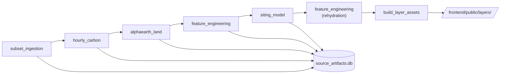
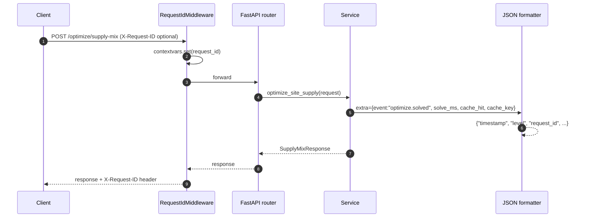
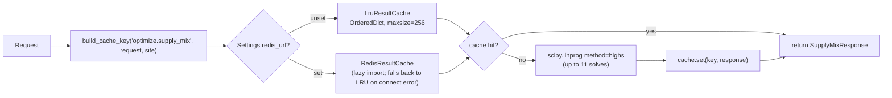
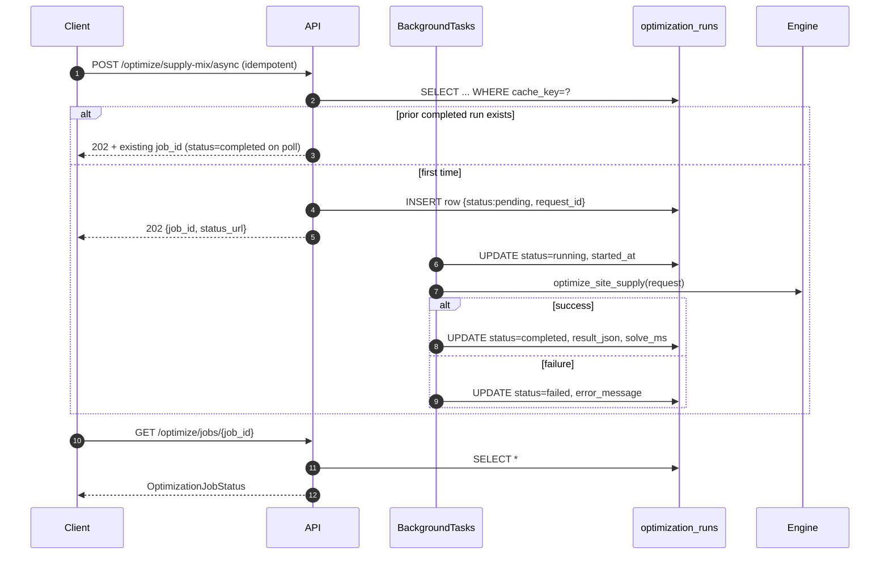
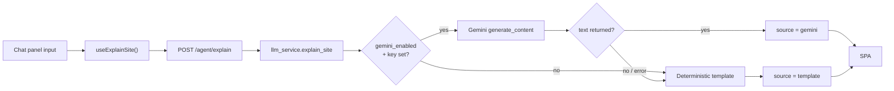

# Loadstar — Architecture

## Request flow

```mermaid
flowchart LR
    SPA["Vite SPA<br/>frontend/"]
    API["FastAPI<br/>backend/api"]
    ReqId["RequestIdMiddleware"]
    SyncOpt["POST /optimize/supply-mix<br/>(sync, cached)"]
    AsyncOpt["POST /optimize/supply-mix/async<br/>+ GET /optimize/jobs/&#123;id&#125;"]
    Sites["GET /sites/* + /layers/*"]
    Agent["POST /agent/explain"]
    Meta["GET /health + /assumptions<br/>+ /meta/source-artifacts"]
    LRU["LruResultCache<br/>(in-process)"]
    BG["BackgroundTasks"]
    Engine["engine.optimizer<br/>(scipy.linprog method=highs)"]
    OptRuns[("optimization_runs<br/>Postgres")]
    Artifacts[("source_artifacts.db<br/>local SQLite ledger,<br/>read-only API")]
    Gemini[("Gemini API<br/>(optional)")]
    StaticLayers[/"frontend/public/layers/*.json<br/>(python -m backend.pipeline.build_layer_assets)"/]

    SPA -->|REST + X-Request-ID| API
    API --> ReqId
    ReqId --> SyncOpt
    ReqId --> AsyncOpt
    ReqId --> Sites
    ReqId --> Agent
    ReqId --> Meta
    Sites -->|GET /layers/&#123;name&#125;| StaticLayers
    Sites -->|live fallback| Engine
    SyncOpt --> LRU --> Engine
    AsyncOpt --> BG --> OptRuns
    BG --> Engine
    Agent -->|live or template| Gemini
    Meta --> Artifacts
```

## Data pipeline

Every CLI is a Typer command following the same shape:

- `--countries SE,DE,IE` (default subset)
- `--output-dir data/processed/subset/`
- `--metadata-database data/processed/source_artifacts.db`

Each step appends one row to `source_artifacts` recording: artifact name,
country scope, version, source name, source status, generated_at,
SHA-256 of the JSON payload, record count, and any fallback note.

## Database schema

Four Postgres tables, defined in `backend/db/002_postgres.sql`:

- `h3_cells` — H3 cell geometry, country, region, resolution.
- `site_features` — fixture-shaped per-cell facts plus the LightGBM viability
  score and SHAP-style contributions.
- `hourly_energy` — one row per zone per hour for price + carbon profiles.
- `optimization_runs` — every async optimizer job. Migration
  `003_optimization_runs_status.sql` adds:
  - `status` (`pending` / `running` / `completed` / `failed`)
  - `started_at`, `completed_at`, `solve_ms`
  - `error_message`, `request_id`

The pipeline-metadata file `data/processed/source_artifacts.db` is a separate
local SQLite ledger written by every pipeline CLI run (single writer,
file-based, no service required) and read by the `/meta/source-artifacts`
endpoint. It is intentional and not the application DB.

## Observability

- `RequestIdMiddleware` accepts inbound `X-Request-ID` (capped at 128 chars)
  or generates a UUID4. Every log record carries the active id via a
  `RequestIdFilter`.
- `JsonFormatter` emits `{timestamp, level, logger, request_id, message,
  **extra}` on a single line. Toggle with `LOG_FORMAT=text` for human-
  readable demo output.
- `/health` reports `version`, `git_sha`, `started_at`, `uptime_seconds`,
  and a `dependencies.{postgres,redis}` block. Each dependency is `ok`,
  `unreachable`, or `disabled` with optional latency.
- `/meta/source-artifacts` exposes the live `source_artifacts.db` rows plus
  a `data_version` fingerprint (SHA-256 over the artifact checksums).

## Optimizer cache

In-process LRU is the default and the only path active for the demo.
Redis is structured behind a `ResultCache` Protocol; flip on with
`REDIS_URL=redis://...` in `.env` and the factory swaps backends without
touching service code.

## Async optimizer + backpressure path

`BackgroundTasks` keeps the worker in the same uvicorn process — the right
trade-off for a single-node hackathon deployment. Multi-node migration is a
local change only: swap `optimizer_jobs.run_supply_mix_job` for an
`arq` / `RQ` / Celery worker reading the same `optimization_runs` table; the
HTTP surface stays unchanged.

## LLM explanation flow

The chat panel renders a small pill — `Live · gemini-3.1-pro-preview` or
`Deterministic template` — so a judge can see exactly which path produced the
explanation. A network blip during the rehearsal therefore cannot break the
demo; the bubble simply renders with the template label.
